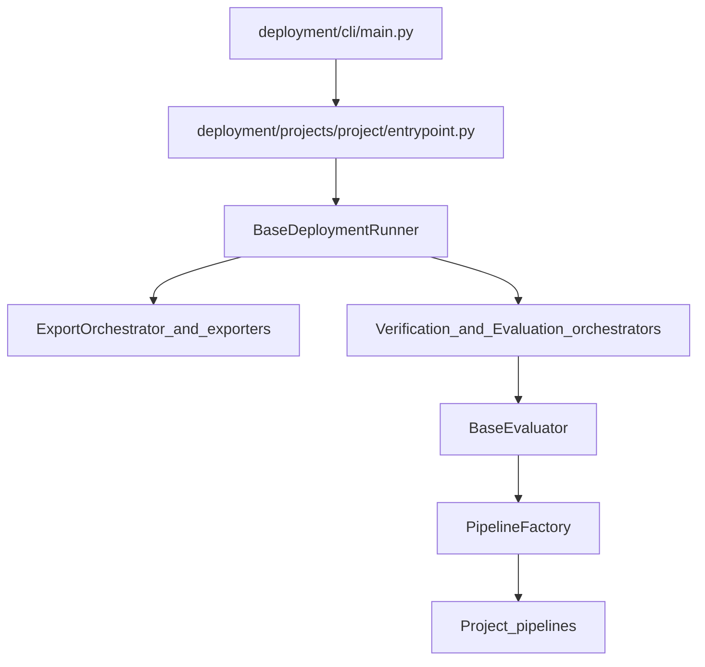

# Deployment architecture

How the framework is wired and what each part is allowed to own. Use this page when you need the mental model of `deployment/` or when you plan to extend it.

For commands and run behavior, use [runbook.md](./runbook.md). For deploy config fields and examples, use [configuration.md](./configuration.md).

## Three layers

1. Entry layer: CLI plus project entrypoints.
2. Runtime layer: runner plus orchestrators and artifact resolution.
3. Execution layer: exporters, inference pipelines, evaluators, and metrics.

## High-level flow



## Layer responsibilities

### Entry layer

- `deployment/cli/main.py` discovers registered project bundles and dispatches to a `ProjectAdapter`.
- Each project `entrypoint.py` loads configs, builds the data loader and evaluator, then creates the project runner.
- Project-specific flags belong in the project bundle, not in the shared CLI.

### Runtime layer

- `deployment/runtime/runner.py` owns the shared sequence: load, export, verify, evaluate.
- `ExportOrchestrator`, `VerificationOrchestrator`, and `EvaluationOrchestrator` keep the runner thin.
- `ArtifactManager` records ONNX and TensorRT artifacts so later stages resolve them consistently.

### Execution layer

- `deployment/exporters/` owns ONNX and TensorRT export mechanics.
- `deployment/pipelines/` owns shared inference pipeline abstractions and factory registration.
- Project `pipelines/` implement backend-specific inference.
- Evaluators own metrics, result reporting, and verification behavior.

## Package map

| Path | Responsibility |
| --- | --- |
| `deployment/cli/` | Unified CLI and shared argument helpers |
| `deployment/configs/` | Typed deployment config and schema |
| `deployment/core/` | Shared contexts, evaluators, verification mixins, and metrics types |
| `deployment/exporters/` | Shared ONNX and TensorRT exporters plus export pipeline bases |
| `deployment/pipelines/` | Global pipeline registry and factory |
| `deployment/runtime/` | Base runner, orchestrators, and artifact management |
| `deployment/projects/<project>/` | Project-specific entrypoint, runner, config, IO, eval, pipelines, and optional export logic |

## Extension contract

This section replaces the old standalone core contract page.

### Runner responsibilities

- `BaseDeploymentRunner` owns the end-to-end deployment flow.
- Project runners inject project-specific loaders, evaluators, wrappers, and optional export pipelines.
- Runners must not own task-specific preprocessing, postprocessing, or metrics logic.

### Evaluator responsibilities

- `BaseEvaluator` is the shared base for task evaluators.
- Evaluators create backend pipelines through `PipelineFactory`.
- Evaluators prepare inputs, normalize outputs, compute metrics, and report results.
- Evaluators should log summaries through `logging`, not `print`.

### Pipeline responsibilities

- `BaseInferencePipeline` owns `preprocess -> run_model -> postprocess`.
- Pipelines execute inference only.
- Pipelines must not load artifacts on their own and must not compute metrics.

### Metrics responsibilities

- Metrics interfaces convert predictions and ground truths into task metrics.
- Metrics code should not depend on runners, exporters, or pipeline factories directly.

## Allowed dependencies

| Dependency | Allowed |
| --- | --- |
| Runner -> Evaluator | Yes |
| Evaluator -> PipelineFactory / Pipelines / Metrics | Yes |
| PipelineFactory -> Pipelines | Yes |
| Pipelines -> Metrics | No |
| Metrics -> Runner / PipelineFactory | No |

## Project shape

Each project bundle should follow this layout:

```text
deployment/projects/<project>/
├── __init__.py
├── entrypoint.py
├── runner.py
├── config/
├── io/
├── eval/
├── pipelines/
└── export/   # optional
```

CenterPoint is the current reference implementation of this structure.
