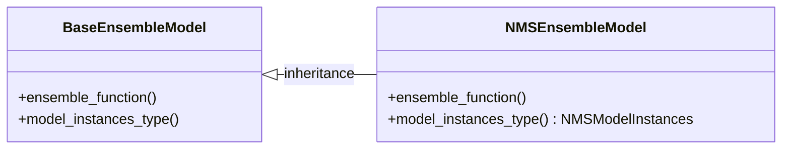

# filter_objects

## ensemble_infos

### Design

- 新しいensemble modelを追加する場合は，[How to add new ensemble model](#how-to-add-new-ensemble-model)に書かれている通り，EnsembleModelとModelInstancesを実装すれば良い．
- 複数のmodelから作成された複数のinfosを取り扱うために，label spaceをalignしている．align方法は[The way to align label space](#the-way-to-align-label-space)を参照．
- ensembleをlabel groupごとに行っている．label groupの指定方法については[ensemble_label_groups](#ensemble_label_groups)を参照．

### How to add new ensemble model

- EnsembleModelを実装
  - BaseEnsembleModelを継承
  - ensemble_functionを実装
  - model_instances_typeを変更
- ModelInstancesを実装
  - BaseModelInstancesを継承



#### ensemble_function

- ensembleの方法を含む関数．
- testしやすいように，純粋関数で実装する．

#### ModelInstances

- 各modelの推論結果であるinstancesを管理するclass.
  - ensemble前に，各instanceのconfidenceを，wight * confidenceにしたい場合や，label_groupに応じてinstanceをfilter場合がある．全instanceに対するfor文での処理を行いたいときには，ModelInstancesにメンバ関数を実装する．
　- 「modelごとに，confidence scoreにかけるweightが違う」という状況に対応するため，modelごとにinstancesを管理させる．
- modelごとの情報を基に，instanceを処理したい場合は，ModelIntancesにメンバ関数を実装し，ensemble_functionでそのメンバ関数を呼び出す．これにより，model出力ごとのparameteに応じてinstances全体を処理できる．
  - e.g. intsanceのconfidence scoreにweightをかけていく．weightはmodelごとに異なる．

```python
# ModelInstancesの使用例
def _nms_ensemble(
    model_instances_list: List[NMSModelInstances],
    target_label_names: List[str],
    iou_threshold: float,
) -> List[Dict]:
    ...

    for model_instances in model_instances_list:
        # instanceごとに，scoreにweightをかけ，label_groupに応じてinstanceをfilterする．
        instances, boxes, scores = model_instances.filter_and_weight_instances(target_label_names=target_label_names)

    ...

    return keep_instances
```

### How to set label group

- 同じlabel groupに属する物体は，ensembleのアルゴリズムにおいてmergeされうる．

#### example 1

- 以下のようにlabel groupを指定すると，car, truck, busを同じlabel groupとしてensembleし，pedestrian, bicycleを同じlabel groupとしてensembleする．
- 同じ物体に対し，car, truck, busの３つのbboxが検出され，ensembleのアルゴリズムにおいてmergeすべきと判定された場合，このbboxは一つにまとめられる．
- carとbicycleは別のlabel groupに属するので，mergeされない．

```python
ensemble_label_groups = [
    ["car", "truck", "bus"],
    ["pedestrian", "bicycle"],
]
```

#### example 2

- 以下のようにlabel groupを指定すると，car, truck, bus，pedestrian, bicycleを別々にensembleする．
- carとtruckは別々のlabel groupに属するので，mergeされない．

```python
ensemble_label_groups=[
    ["car"],
    ["truck"],
    ["bus"],
    ["pedestrian"],
    ["bicycle"],
]
```

### The way to align label space

- 各model出力のinfoは，それぞれのmodelのlabel空間に準拠して作成されている．
  - そのため，model 1は，推論結果のidが0の場合はcarを表すが，model 2の場合，推論結果のidが0の場合はpedestrianを表す，というようなことが発生する．
  - よって，複数のmodel出力をalignする必要がある．
- 以下のような手順で，label空間をalignしている．
  - Step1. 各model出力metainfoをマージして，共通のlabel spaceを作成
  - Step2. 各model出力の結果を共通のlabel spaceに準拠させる
    - e.g. model 2はpedestrianのidが0であったとする．共通のlabel spaceではpedestrianのidが3になった場合，model 2のinfoのpedestrianのidを3に変更する．
    - e.g. model 3はconeのidが0であったとする．共通のlabel spaceではconeのidが5になった場合，model 3のinfoのconeのidを5に変更する．


