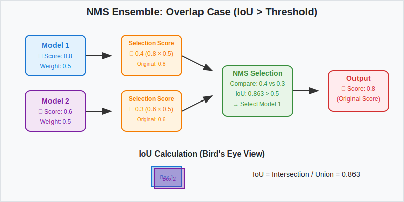
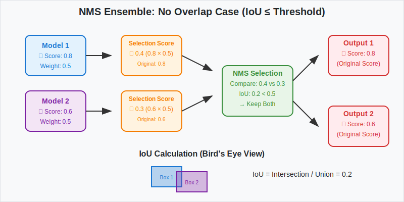

# filter_objects

## Overview

Filter objects provides components for filtering and ensemble processing of 3D object detection results:
- **ThresholdFilter**: Confidence-based filtering of 3D object detection results
- **NMSEnsembleModel**: Non-Maximum Suppression ensemble for multiple model predictions

## filter_objetcs

### Design

- To add a new ensemble model, implement `Filter` as described in [How to add new filter](#how-to-add-new-filter).

### Algorithm Flow: ThresholdFilter

ThresholdFilter removes low-confidence predictions using configurable thresholds per class.


#### Usage Example

```python
Input: [car: 0.8, car: 0.3, pedestrian: 0.7, bicycle: 0.2]
Thresholds: {car: 0.5, pedestrian: 0.6, bicycle: 0.4}
                           ↓
Output: [car: 0.8, pedestrian: 0.7] # car:0.3 and bicycle:0.2 filtered out
```

#### Features

- **Configurable Thresholds**: Different confidence thresholds per class
- **Boundary Handling**: Proper handling of edge cases at exact threshold values
- **Multi-frame Support**: Processing multiple time frames
- **Unknown Class Handling**: Graceful handling of unmapped classes
- **Statistics Logging**: Detailed filtering statistics

### How to add new filter

- Implement `Filter`
  - Inherit from `BaseFilter`
  - Override `filter()` and `_should_filter_instance()`


#### filter

- Function containing the main filtering logic
- Processes the entire dataset and applies filtering to each frame
- Must return filtered dataset info with statistics

#### _should_filter_instance

- Function that determines whether a single instance should be filtered out
- Override to implement the core filtering criteria here
- Should return `True` if instance should be filtered, `False` if kept

#### Example Implementation

```python
@TASK_UTILS.register_module()
class CustomFilter(BaseFilter):
    ...

    def _should_filter_instance(self, pred_instance_3d: Dict[str, Any], category: str) -> bool:
        ...

        # Add your custom filtering criteria
        if this_object_should_be_filtered_out:
            return True

        return False

    def filter(self, predicted_result_info: Dict[str, Any], info_name: str) -> Dict[str, Any]:
        # ... initialize counters and iterate through frames ...  
        for pred_instance_3d in frame_info["pred_instances_3d"]:
            ...

            # Core: Call _should_filter_instance to determine filtering
            if not self._should_filter_instance(pred_instance_3d, category):
                filtered_pred_instances.append(pred_instance_3d)
            else:
                # Instance is filtered out
                filtered_instances[category] += 1

        ...
        return filtered_predicted_result_info
```

## ensemble_infos

### Design

- To add a new ensemble model, implement `EnsembleModel` and `ModelInstances` as described in [How to add new ensemble model](#how-to-add-new-ensemble-model).
- Label spaces are aligned to handle multiple outputs from different models. For details, refer to [The way to align label space](#the-way-to-align-label-space).
- Ensemble operations are executed per label group. For label group configuration, see [ensemble_label_groups](#ensemble_label_groups).

### Algorithm Flow: NMS Ensemble

NMSEnsembleModel combines predictions from multiple models using Non-Maximum Suppression.


**Important**: Weighted scores are used for NMS selection only. Original confidence scores are preserved in the output instances.

#### NMS Process Cases

##### Case 1: High IoU (Overlap) - Suppression



When two detections have high IoU (> threshold), the detection with lower weighted score is suppressed, but the original confidence score is preserved in the output.

##### Case 2: Low IoU (No Overlap) - Keep Both



When two detections have low IoU (≤ threshold), both detections are kept in the final output with their original confidence scores preserved.

#### Bird's Eye View IoU Calculation


#### NMS Decision Examples


#### Example Data

```python
# Sample 3D bounding box [x, y, z, dx, dy, dz, yaw]
Box A: [1.0, 2.0, 0.0, 4.0, 2.0, 1.5, 0.1]  # Score: 0.8
Box B: [1.1, 2.1, 0.0, 4.0, 2.0, 1.5, 0.1]  # Score: 0.6, IoU ≈ 0.863

# Example NMS results with different thresholds:
iou_threshold = 0.5:  # 0.863 > 0.5 → Keep 1 box (higher score: Box A)
iou_threshold = 0.9:  # 0.863 < 0.9 → Keep 2 boxes (both Box A and Box B)
```

### How to add new ensemble model

- Implement `EnsembleModel`
  - Inherit from `BaseEnsembleModel`
  - Override `ensemble_function()`
- Implement `ModelInstances`
  - Inherit from `BaseModelInstances`


#### ensemble_function

- Function containing the ensemble logic
- Override as a pure function for better testability

#### ModelInstances

- Class managing inference results (instances) from each model
  - Handles pre-ensemble processing such as applying weights to confidence scores and filtering instances based on label groups
  - Manages instances per model to support model-specific weights
- Model-specific instance processing should be implemented as `ModelInstances` member functions and called from `ensemble_function()`
  - Example: Applying model-specific weights to instance confidence scores

```python
# Example usage of ModelInstances
def _nms_ensemble(
    model_instances_list: List[NMSModelInstances],
    target_label_names: List[str],
    iou_threshold: float,
) -> List[Dict]:
    ...

    for model_instances in model_instances_list:
        # Apply weights to scores and filter instances based on label group
        instances, boxes, scores = model_instances.filter_and_weight_instances(target_label_names=target_label_names)

    ...

    return keep_instances
```

### How to set label group

- Objects in the same label group may be merged by the ensemble algorithm

#### example 1

- With the label group configuration outlined below, 'car', 'truck', and 'bus' are ensembled into one group, while 'pedestrian' and 'bicycle' form another.
- If an object is detected with three distinct bounding boxes—for example, one for 'car', one for 'truck', and one for 'bus'—and the ensemble algorithm determines these should be merged, they are consolidated into a single bounding box.
- 'Car' and 'bicycle' belong to different label groups and are therefore not merged.

```python
ensemble_label_groups = [
    ["car", "truck", "bus"],
    ["pedestrian", "bicycle"],
]
```

#### example 2

- With the label group configuration outlined below, 'car', 'truck', 'bus', 'pedestrian', and 'bicycle' are each ensembled separately.
- 'Car' and 'truck' belong to different label groups and are therefore not merged.

```python
ensemble_label_groups=[
    ["car"],
    ["truck"],
    ["bus"],
    ["pedestrian"],
    ["bicycle"],
]
```

### The way to align label space

- Each model's output follows its own label space
  - For example, in model A, ID 0 might represent car but in model B, ID 0 might represent pedestrian
  - Therefore, we need to align outputs from multiple models to a common label space
- Label space alignment follows these steps:
  - Step 1: Merge metainfo from all models to create a common label space
  - Step 2: Convert each model's output to conform to the common label space
    - Example: Change pedestrian ID from 0 to 3 in model B's output
    - Example: Change cone ID from 0 to 5 in model C's output


