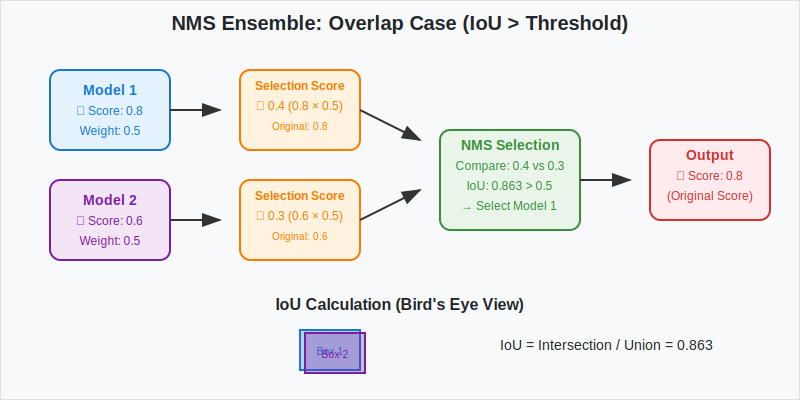
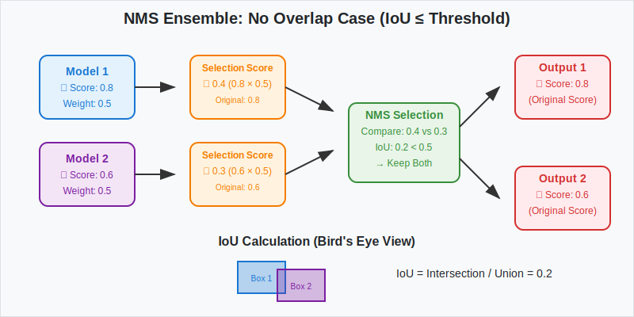

# Filter Objects Test Suite

Comprehensive test suite for ThresholdFilter and NMSEnsembleModel classes.

## Design Document

Before you add the new test, please check [the design document for `filter_objects`](../docs/filter_objects.md) and confirm that your plan follows the design.

## Directory Structure

```
test/
├── conftest.py              # Shared fixtures and test data
├── test_threshold_filter.py # ThresholdFilter tests
├── test_nms_ensemble_model.py # NMSEnsembleModel tests
└── README.md               # This file
```

## ThresholdFilter Tests

Tests confidence-based filtering functionality:

- **Basic Filtering**: Confidence threshold application (≥ threshold kept)
- **Boundary Values**: Edge cases at exact threshold values  
- **Empty Data**: Handling of empty input/output scenarios
- **Multi-frame**: Processing multiple time frames
- **Unknown Classes**: Graceful handling of unmapped classes
- **Statistics Logging**: Verification of filtering statistics

## NMSEnsembleModel Tests

Tests Non-Maximum Suppression ensemble functionality:

### Test Categories

#### 1. NMSModelInstances
- Instance filtering and weighting per model
- Empty result handling

#### 2. Ensemble Logic
- Single/multiple model ensemble
- Overlapping prediction handling  
- Label group processing
- Empty prediction scenarios
- Weight validation

#### 3. Helper Functions
- **IoU Calculation**: Bird's Eye View intersection over union
- **NMS Algorithm**: Non-maximum suppression with various thresholds

### Visual Test Documentation

#### High IoU Case (Suppression)


Shows how overlapping bounding boxes (IoU > threshold) are processed through NMS, with one detection being suppressed while preserving original confidence scores.

#### Low IoU Case (Keep Both)  


Demonstrates how non-overlapping detections (IoU ≤ threshold) are both kept in the final output with original confidence scores preserved.

## Running Tests

```bash
# All tests (42 total)
python -m pytest tools/auto_labeling_3d/filter_objects/test/ -v

# Specific component
python -m pytest tools/auto_labeling_3d/filter_objects/test/test_threshold_filter.py -v
python -m pytest tools/auto_labeling_3d/filter_objects/test/test_nms_ensemble_model.py -v
```
