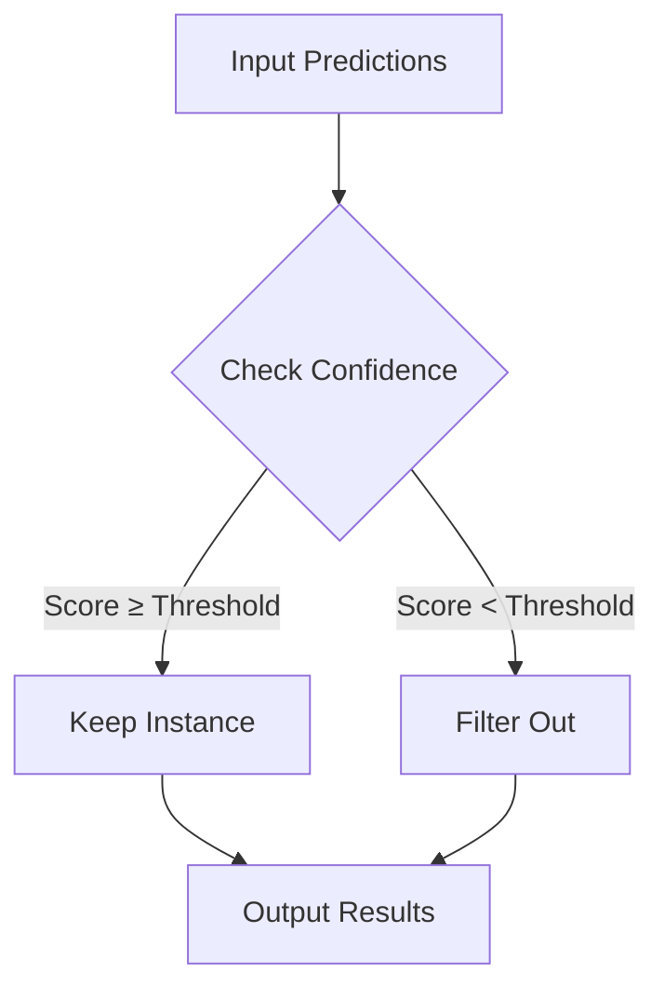
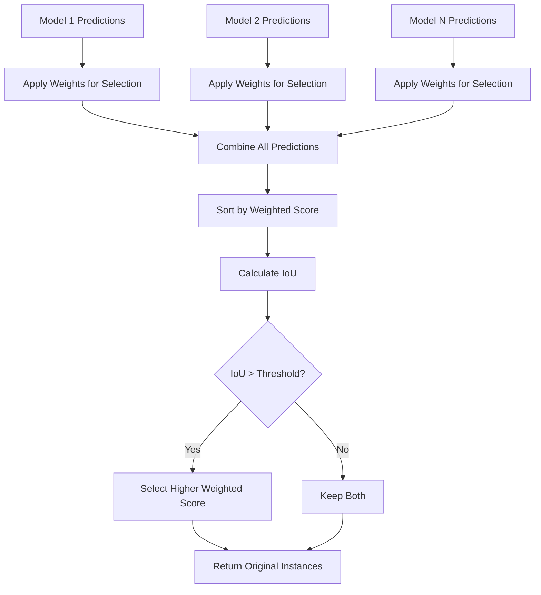
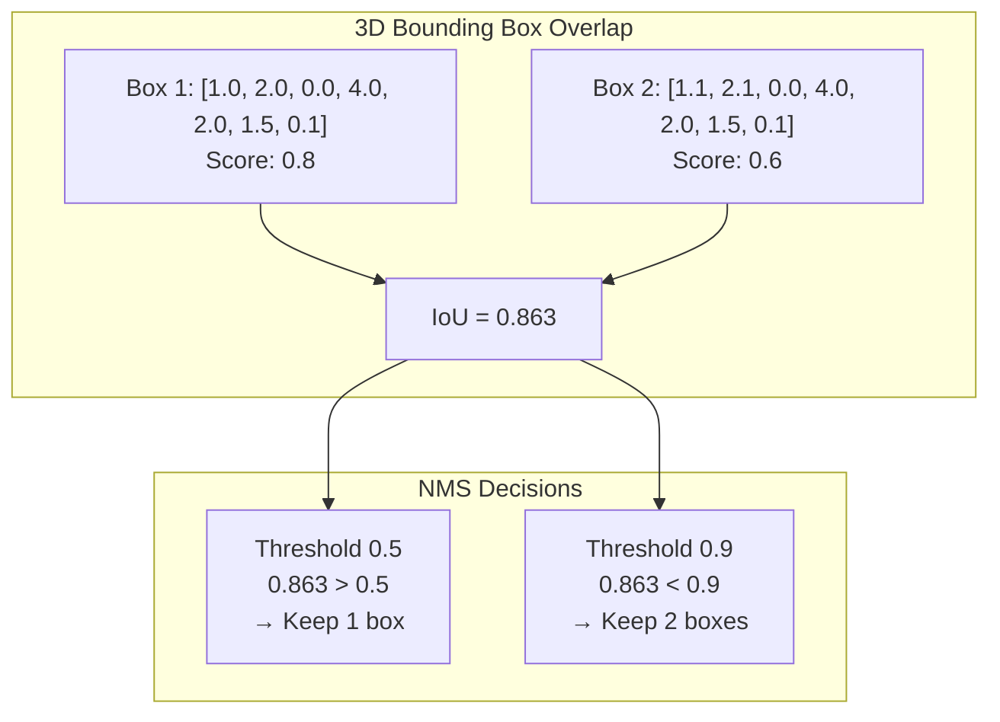
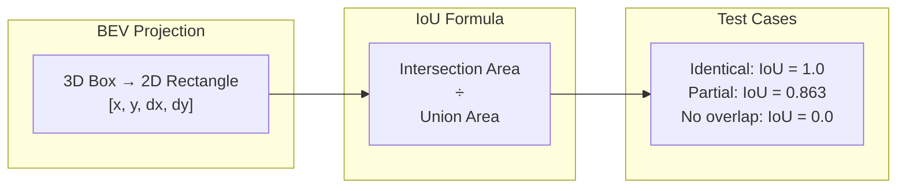

# Filter Objects Test Suite

Comprehensive test suite for ThresholdFilter and NMSEnsembleModel classes.

## Overview

This test suite validates two key components:
- **ThresholdFilter**: Confidence-based filtering of 3D object detection results
- **NMSEnsembleModel**: Non-Maximum Suppression ensemble for multiple model predictions

## Test Structure

```
test/
├── conftest.py              # Shared fixtures and test data
├── test_threshold_filter.py # ThresholdFilter tests
├── test_nms_ensemble_model.py # NMSEnsembleModel tests
└── README.md               # This file
```

## ThresholdFilter Tests

ThresholdFilter removes low-confidence predictions using configurable thresholds per class.

### Algorithm Flow



### Test Categories

```
Input: [car: 0.8, car: 0.3, pedestrian: 0.7, bicycle: 0.2]
Thresholds: {car: 0.5, pedestrian: 0.6, bicycle: 0.4}
                           ↓
Output: [car: 0.8, pedestrian: 0.7] # car:0.3 and bicycle:0.2 filtered out
```

- **Basic Filtering**: Confidence threshold application (≥ threshold kept)
- **Boundary Values**: Edge cases at exact threshold values
- **Empty Data**: Handling of empty input/output scenarios
- **Multi-frame**: Processing multiple time frames
- **Unknown Classes**: Graceful handling of unmapped classes
- **Statistics Logging**: Verification of filtering statistics

## NMSEnsembleModel Tests

NMSEnsembleModel combines predictions from multiple models using Non-Maximum Suppression.

### Algorithm Flow



**Note**: Weighted scores are used for NMS selection only. Original confidence scores are preserved in the output instances.

### Ensemble Process Visualization

#### Case 1: High IoU (Overlap) - Suppression


This visualization shows how two overlapping bounding boxes from different models are processed through the NMS ensemble algorithm. The weighted scores (0.4 vs 0.3) are used only for NMS selection decisions, while the original confidence scores (0.8) are preserved in the final output instances.

#### Case 2: Low IoU (No Overlap) - Keep Both


This visualization demonstrates the case where two detections from different models have low IoU (0.2 < 0.5), resulting in both detections being kept in the final output with their original confidence scores preserved.

### Test Categories

#### 1. NMSModelInstances
- Instance filtering and weighting per model
- Empty result handling

#### 2. Ensemble Logic



### Bird's Eye View IoU Calculation



- Single/multiple model ensemble
- Overlapping prediction handling
- Label group processing
- Empty prediction scenarios
- Weight validation

#### 3. Helper Functions
- **IoU Calculation**: Bird's Eye View intersection over union
- **NMS Algorithm**: Non-maximum suppression with various thresholds

### Key Test Data

```python
# Sample 3D bounding box [x, y, z, dx, dy, dz, yaw]
Box A: [1.0, 2.0, 0.0, 4.0, 2.0, 1.5, 0.1]
Box B: [1.1, 2.1, 0.0, 4.0, 2.0, 1.5, 0.1]  # IoU ≈ 0.863
```

## Running Tests

```bash
# All tests
python -m pytest tools/auto_labeling_3d/filter_objects/test/ -v

# Specific component
python -m pytest tools/auto_labeling_3d/filter_objects/test/test_threshold_filter.py -v
python -m pytest tools/auto_labeling_3d/filter_objects/test/test_nms_ensemble_model.py -v
```
