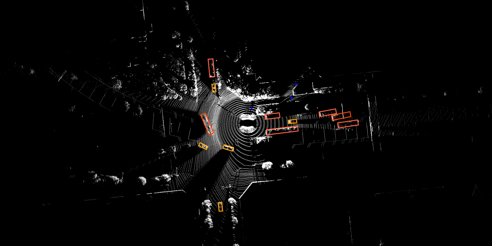

# tools/detection3d

The pipeline to make the model.
It contains training, evaluation, and visualization for 3D detection and 3D semantic segmentation.

- [Support priority](https://github.com/tier4/autoware-ml/blob/main/docs/design/autoware_ml_design.md#support-priority): Tier S
- Supported dataset
  - [x] NuScenes
  - [x] T4dataset with 3D detection
  - [ ] T4dataset with 3D semantic segmentation
- Other supported feature
  - [ ] Add unit test

## 1. Setup environment

See [setting environment](/tools/setting_environment/)

## 2. Prepare dataset

Prepare the dataset you use.

### 2.1. nuScenes

- Run docker

```sh
docker run -it --rm --gpus '"device=0"' --shm-size=64g --name awml -p 6006:6006 -v $PWD/:/workspace -v $PWD/data:/workspace/data autoware-ml
```

- Make info files for nuScenes
  - If you want to make own pkl, you should change from "nuscenes" to "custom_name"

```sh
python tools/detection3d/create_data.py nuscenes --root-path ./data/nuscenes --out-dir ./data/nuscenes --extra-tag nuscenes
```

### 2.2. T4dataset

- Run docker

```sh
docker run -it --rm --gpus '"device=0"' --shm-size=64g --name awml -p 6006:6006 -v $PWD/:/workspace -v $PWD/data:/workspace/data autoware-ml
```

- (Choice) Make info files for T4dataset XX1
  - This process takes time.

```sh
python tools/detection3d/create_data_t4dataset.py --root_path ./data/t4dataset --config autoware_ml/configs/detection3d/dataset/t4dataset/xx1.py --version xx1 --max_sweeps 2 --out_dir ./data/t4dataset/info/user_name
```

- (Choice) Make info files for T4dataset X2
  - This process takes time.

```sh
python tools/detection3d/create_data_t4dataset.py --root_path ./data/t4dataset --config autoware_ml/configs/detection3d/dataset/t4dataset/x2.py --version x2 --max_sweeps 2 --out_dir ./data/t4dataset/info/user_name
```

## 3. Train
### 3.1. Change config

- You can change batchsize by file name.
  - For example, 1×b1 -> 2×b8
- If you use custom pkl file, you need to change pkl file from `nuscenes_infos_train.pkl`.

### 3.2. Train

- Train in general by below command.
  - See each [projects](projects) for detail command of training and evaluation.

```sh
python tools/detection3d/train.py {config_file}
```

- You can use docker command for training as below.

```sh
docker run -it --rm --gpus '"device=0"' --name autoware-ml --shm-size=64g -d -v $PWD/:/workspace -v $PWD/data:/workspace/data autoware-ml bash -c '<command for each projects>'
```

### 3.3. Log analysis by Tensorboard

- Run the TensorBoard and navigate to http://127.0.0.1:6006/

```sh
tensorboard --logdir work_dirs --bind_all
```

## 4. Analyze
### 4.1. Evaluation

- Evaluation

```sh
python tools/detection3d/test.py {config_file} {checkpoint_file}
```

- After training, you can test for each epoch checkpoints as below.
  - `min_epoch` is the epoch you want to start to test. If you set 20, test epoch_20.pth, epoch_21.pth, epoch_22.pth...

```sh
python tools/detection3d/test_all.py {config_file} {train_results_directory} {min_epoch}
```

### 4.2. Visualization

- Visualization for 3D view

See [rerun_visualization](/tools/rerun_visualization/)


- Visualization for BEV view
  - This script is simple debug tools.
  - This tool don't have image information, so you can use it when you make visualization images for public place like PR.
  - Image information often has personal information, so you cannot use it in public place in many case.

```sh
python tools/detection3d/visualize_bev.py {config_file} --checkpoint {config_file}
```



## 5. Deploy

See each projects
