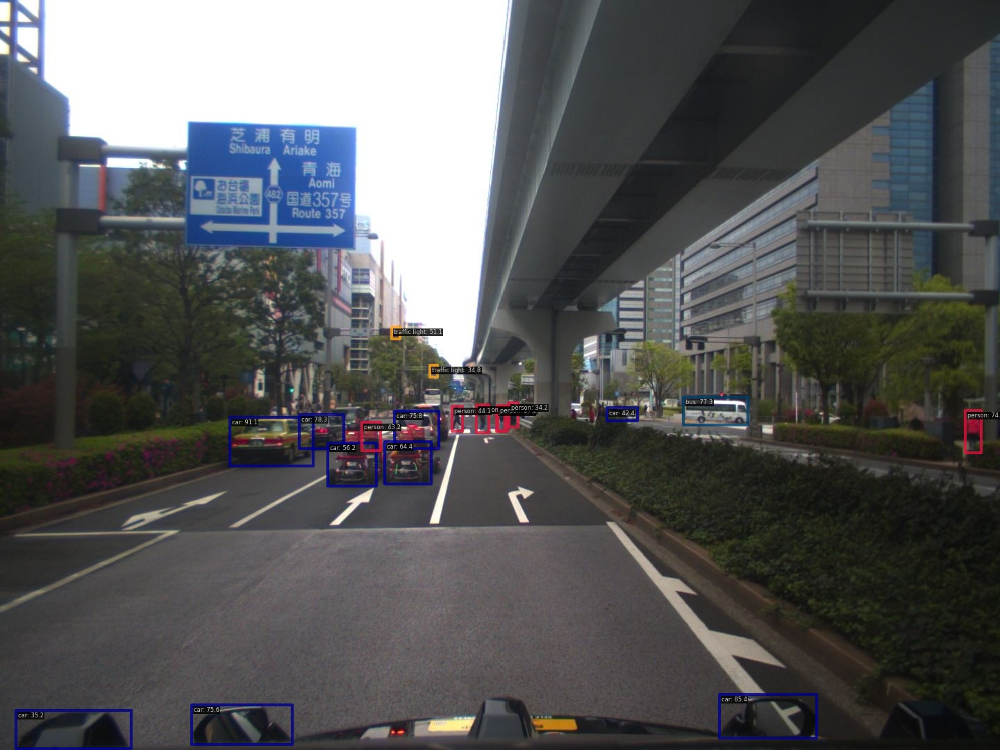
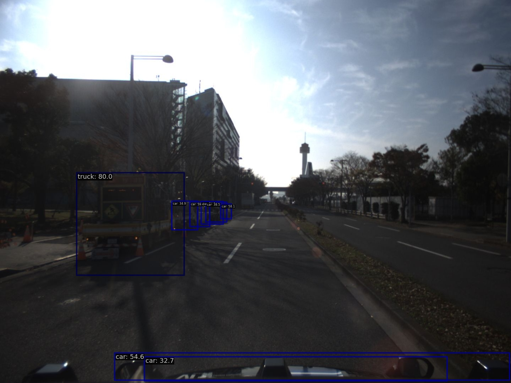
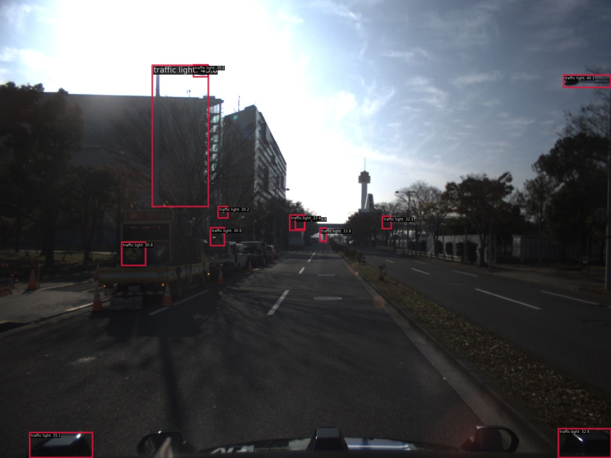

# det2d_object_num_selector

- Object number threshold scene selector with 2D detection

## Example result
### Select scene for traffic light

We use YOLOX-L for filtering traffic light.

GLIP fail to detect with traffic signals and poles.

- from T4dataset data

