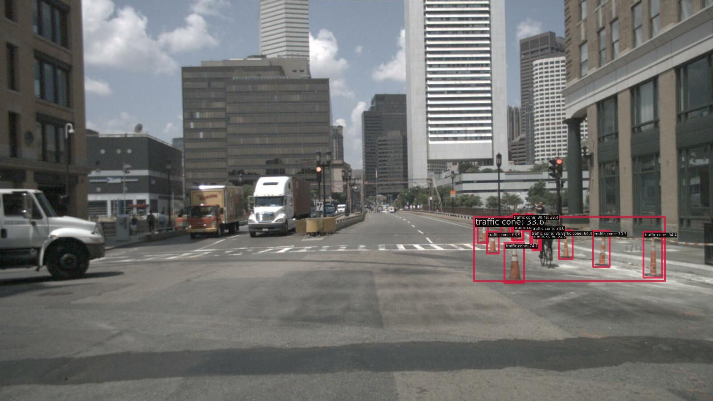

# (TBD) open_vocab_2d_object_num_selector

- Object number threshold scene selector with 2D open vocabulary

## Example result
### Select scene for traffic cone

We use GLIP for filtering traffic cones.

- from Nuscenes data

