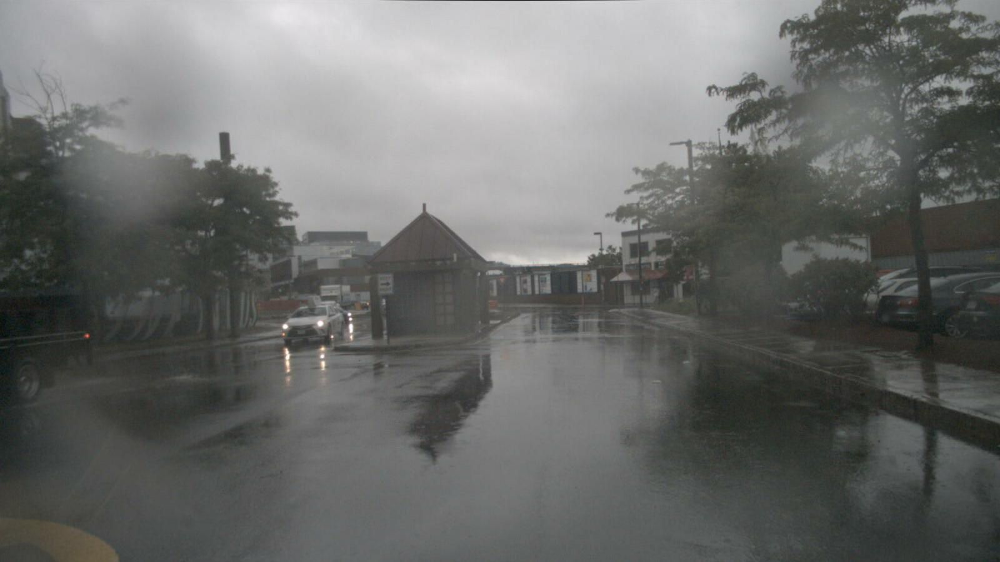
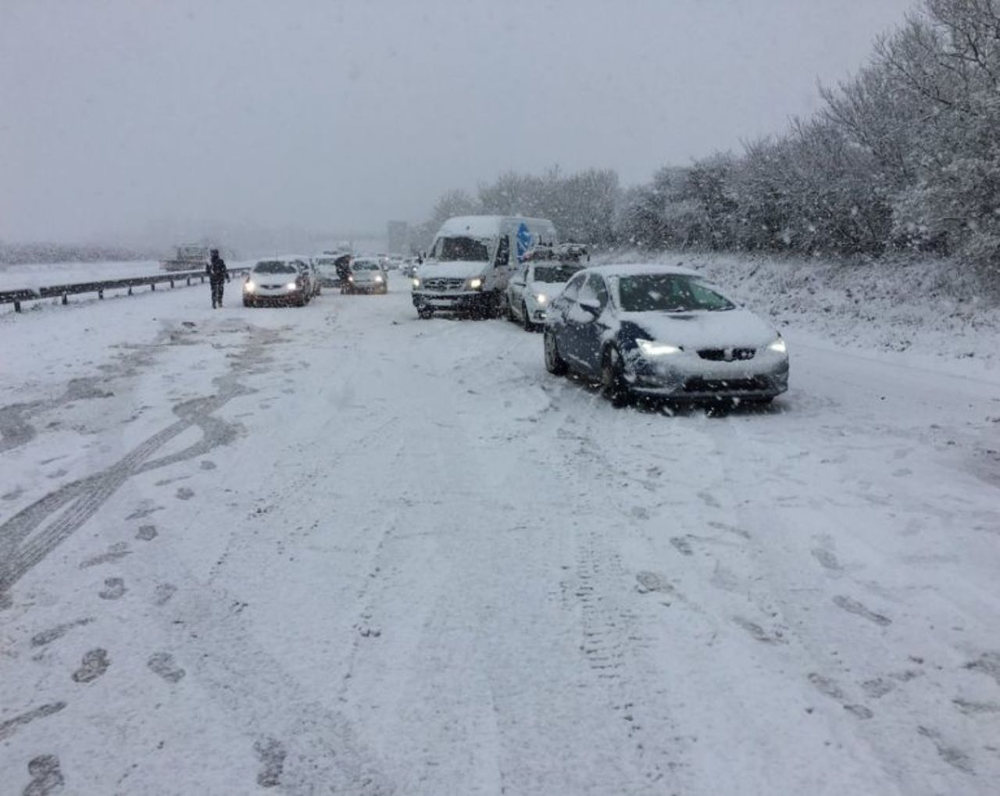
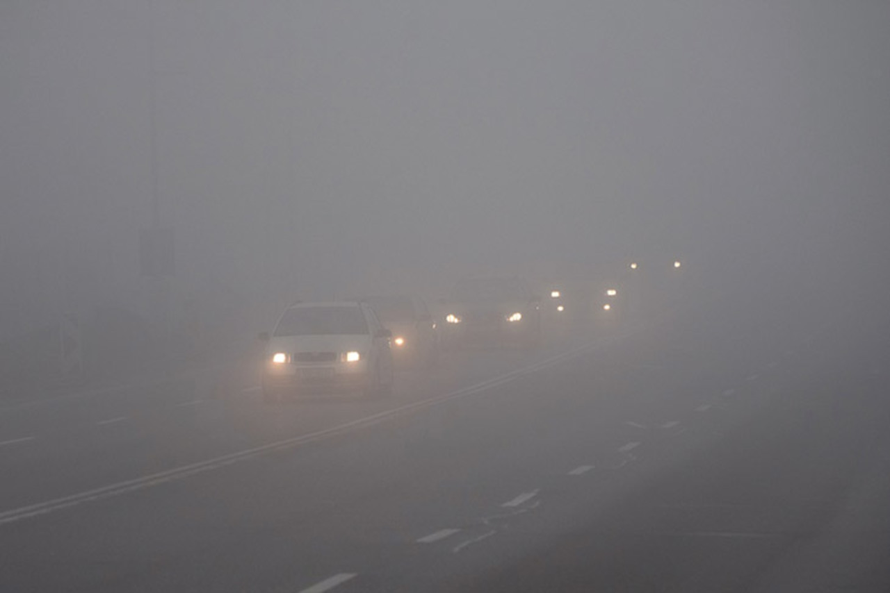

# (TBD) Select scene with VLM QA

## Example usage
### Scene selection for weather

- We use BLIP-2 for filtering the condition of weather
- Rain data from Nuscenes data



```
{'question': 'how is the weather', 'pred_answer': 'rain'}
```

- Snow data from [DAWN dataset](https://ar5iv.labs.arxiv.org/html/2008.05402)



```
{'question': 'how is the weather', 'pred_answer': 'snow'}
```

- Fog data from [DAWN dataset](https://ar5iv.labs.arxiv.org/html/2008.05402)



```
{'question': 'how is the weather', 'pred_answer': 'fog'}
```
